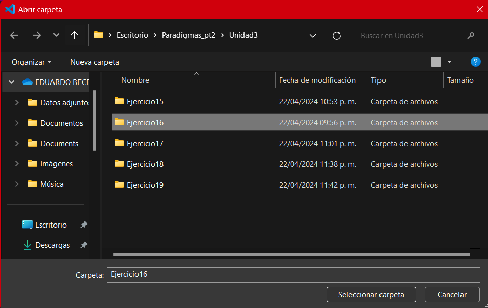
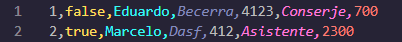

# Base de datos de una empresa 👷👨‍⚕️
Este es un programa desarrollado en la materia de ***Paradigmas de la programación*** utilizando y haciendo énfasis en la programación orientada a objetos (POO).

El objetivo principal de este proyecto es aprender a manejar archivos CSV para leer y guardar datos a través de nuestro código. 

## Índice

* ### [Instalación del programa](#instalación-del-programa-)
* ### [Comienzo del programa](#comienzo-del-programa-)
    + #### [Opciones del programa](#opciones-disponibles-dentro-del-programa-1️⃣2️⃣3️⃣4️⃣)
        1. [Dar de alta a empleado](#1-dar-de-alta-a-empleado)
        2. [Dar de baja a empleado](#2-dar-de-baja-a-empleado)
        3. [Mostrar a los empleados](#3-mostrar-a-los-empleados)
        4. [Guardar los cambios](#4-guardar-en-el-archivo-empleados)
        5. [Salir](#5-salir)
* ### [Versión](#versión-)
* ### [Colaboradores](#colaboradores-)

## **Instalación del programa** 🆘
Una vez descargado, debes extraer la carpeta **.zip** en un lugar que recuerdes.

Debes abrir VSCode y presionar la combinación **Ctrl+k+o** para seleccionar la carpeta que acabas de extraer.

  
    
    Debes dar un clic en la carpeta y presionar la opción "Seleccionar carpeta"

Para iniciar el programa, necesitas correr el archivo ***Ejercicio16.java***.

## **Comienzo del programa** 🛫
Para este programa, cada empleado cuenta con las siguientes características o atributos:

| Atributo| Tipo de valor | Descripción  |
|-----------------| ----------------|------------------|
|**ID**                           | Int     | Es un número de identificación para cada empleado.|
|**Online**                       | Boolean |Indica si el empleado sigue activo en la empresa o no, siempre se empezará con *True*. |
|**Nombre**                       | String  | El nombre del trabajador.      |
|**Apellido**                     | String  | El apellido del trabajador.      |
|**Número de seguro social (NSS)**| String  | El NSS del trabajador.  **No es necesario, nunca ocurren accidentes :) .**|
|**Descripción de su puesto**     | String  | Aquí se almacena el tipo de trabajo que desarrolla el empleado.|
|**Salario de su puesto**         | Int     | El sueldo que recibe el empleado por su puesto de trabajo.|

### **Opciones disponibles dentro del programa** 1️⃣2️⃣3️⃣4️⃣
Lo primero que se  va a presentar al ejecutar el código es el menú y se da a elegir entre 5 opciones diferentes, esto es un bucle, así que no se terminará hasta seleccionar la opción 5.

  
    
    Menú del programa.

#### ***1. Dar de alta a empleado.***
En este apartado de del programa se deberá de proporcionar información como:
+ Nombre.
+ Apellido.
+ Número de seguro social (NSS).

**NOTAS:** El *ID* no es necesario introducirlo porque este es agregado automáticamente y *Online* siempre es true al dar de alta a un empleado.

Luego se deberá seleccionar uno de los puestos disponibles, cada puesto cuenta con su propia *descripción y sueldo*.

#### ***2. Dar de baja a empleado***
Cuando se ejecuta esta acción, se debe ingresar el ***ID*** del empleado al cual quieres dar de baja, si se ingresa correctamente, lo único que ocurre es que el valor del atributo ***Online*** cambia a false, nunca es eliminado del archivo CSV.

  
    
    Ejemplo. El empleado Eduardo Becerra fue dado de baja

#### ***3. Mostrar a los empleados***
Se muestra en consola a los empleados que siguen trabajando en la empresa, es decir, sólo a los que tienen el valor de ***true*** en la variable ***Online***.

#### ***4. Guardar en el archivo empleados***
Los cambios hechos en los empleados (dado de alta o baja) se van a ver reflejados en nuestro archivo CSV.

#### ***5. Salir***
Esta instrucción rompe el ciclo y termina el programa. Al salir, **se guardan automáticamente** los cambios hechos.

## **Versión** 🔧🦺
El código actual se encuentra en la versión 1.0 de desarrollo. Este está creado en el lenguaje de programación **Java**.

## **Colaboradores** 🛬
**Idea del proyecto.**  Laura Trejo Medina.

**Código.**  Laura Trejo Medina y Becerra Flores Jose Eduardo.
